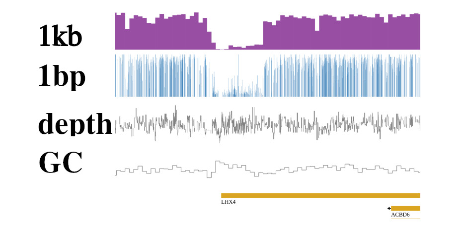

# R
{:.no_toc }
best practices for R

# Table of contents
{:.no_toc.text-delta }

- TOC
{:toc}

---

# ucsctool

## quick start

```bash
apptainer pull docker://xiang2019/ucsctools:v1.04.00

apptainer shell --writable-tmpfs  ucsctools_v1.04.00.sif

ln -s /lib/x86_64-linux-gnu/libcurl-gnutls.so.4 /lib/x86_64-linux-gnu/libcurl.so.4

Apptainer> bedGraphToBigWig 
bedGraphToBigWig v 2.9 - Convert a bedGraph file to bigWig format (bbi version: 4).
usage:
   bedGraphToBigWig in.bedGraph chrom.sizes out.bw
```

OR fix

```bash
apptainer build --sandbox ucsctools_v1.04.00 ucsctools_v1.04.00.sif

$ cat ucsctools_v1.04.00/.singularity.d/env/90-environment.sh 
#!/bin/sh
# Copyright (c) Contributors to the Apptainer project, established as
#   Apptainer a Series of LF Projects LLC.
#   For website terms of use, trademark policy, privacy policy and other
#   project policies see https://lfprojects.org/policies
# Copyright (c) 2018-2021, Sylabs Inc. All rights reserved.
# This software is licensed under a 3-clause BSD license. Please consult
# https://github.com/apptainer/apptainer/blob/main/LICENSE.md regarding your
# rights to use or distribute this software.

# Custom environment shell code should follow
ln -s /lib/x86_64-linux-gnu/libcurl-gnutls.so.4 /lib/x86_64-linux-gnu/libcurl.so.4


apptainer build ucsctools_v1.04.01.sif ucsctools_v1.04.00 
```

Then you can run the tools in the container.

OK !!!
```bash
singularity shell --writable --bind /data2:/mnt  ucsctools_v1.04.01.sif
```


## bedSort

[bedSort](http://hgdownload.cse.ucsc.edu/admin/exe/linux.x86_64/) is a tool for sorting BED files. It can sort by chromosomal position or by any other user-defined field. The tool can also handle compressed and uncompressed BED files.

### benchmark bedSort VS. sort -k1,1 -k2,2n

| **性能指标**                   | **bedSort**                     | **sort**                          |
|---------------------------------|---------------------------------|-----------------------------------|
| **用户时间 (User time)**        | 4.87 秒                         | 16.08 秒                          |
| **系统时间 (System time)**      | 1.12 秒                         | 1.38 秒                           |
| **CPU 使用率 (CPU usage)**      | 98%                             | 384%                              |
| **总时间 (Elapsed time)**       | 6.06 秒                         | 4.54 秒                           |
| **最大驻留集大小 (Max Resident Set Size)** | 3,036,960 KB                    | 4,308,480 KB                      |
| **轻微页面错误 (Minor Page Faults)** | 758,675 次                      | 1,077,008 次                      |
| **文件系统输入 (File system inputs)** | 24                              | 200                               |
| **文件系统输出 (File system outputs)** | 1,682,112 次                    | 1,682,112 次                      |


```bash
tail -n +1 test.bedGraph | head -100000000 > demo.bed
```

bedSort


```bash
/usr/bin/time -v ~/software/ucsc_tools/bedSort/bedSort demo.bed demo.sort.bed

        Command being timed: "/home/jiazet/software/ucsc_tools/bedSort/bedSort demo.bed demo.sort.bed"
        User time (seconds): 4.87
        System time (seconds): 1.12
        Percent of CPU this job got: 98%
        Elapsed (wall clock) time (h:mm:ss or m:ss): 0:06.06
        Average shared text size (kbytes): 0
        Average unshared data size (kbytes): 0
        Average stack size (kbytes): 0
        Average total size (kbytes): 0
        Maximum resident set size (kbytes): 3036960
        Average resident set size (kbytes): 0
        Major (requiring I/O) page faults: 0
        Minor (reclaiming a frame) page faults: 758675
        Voluntary context switches: 13349
        Involuntary context switches: 27
        Swaps: 0
        File system inputs: 24
        File system outputs: 1682112
        Socket messages sent: 0
        Socket messages received: 0
        Signals delivered: 0
        Page size (bytes): 4096
        Exit status: 0
```

time -v 用于记录命令执行的详细时间和系统资源使用情况。

system sort
```bash
/usr/bin/time -v sort -k1,1 -k2,2n demo.bed > demo.sysSort.bed

        Command being timed: "sort -k1,1 -k2,2n demo.bed"
        User time (seconds): 16.08
        System time (seconds): 1.38
        Percent of CPU this job got: 384%
        Elapsed (wall clock) time (h:mm:ss or m:ss): 0:04.54
        Average shared text size (kbytes): 0
        Average unshared data size (kbytes): 0
        Average stack size (kbytes): 0
        Average total size (kbytes): 0
        Maximum resident set size (kbytes): 4308480
        Average resident set size (kbytes): 0
        Major (requiring I/O) page faults: 3
        Minor (reclaiming a frame) page faults: 1077008
        Voluntary context switches: 1824
        Involuntary context switches: 301
        Swaps: 0
        File system inputs: 200
        File system outputs: 1682112
        Socket messages sent: 0
        Socket messages received: 0
        Signals delivered: 0
        Page size (bytes): 4096
        Exit status: 0
```

BUGS:

so you need to install the GLIBC version 2.33 or higher to run bedSort. Otherwise, you will get the following error:

```bash
bedSort: /usr/lib/x86_64-linux-gnu/libc.so.6: version 'GLIBC_2.33' not found (required by bedSort)
```


## bedPileUps

this function can find overlap in bed files and count the number of bases in each overlap.

```bash
bedPileUps
bedPileUps - Find (exact) overlaps if any in bed input
usage:
   bedPileUps in.bed
Where in.bed is in one of the ascii bed formats.
The in.bed file must be sorted by chromosome,start,
  to sort a bed file, use the unix sort command:
     sort -k1,1 -k2,2n unsorted.bed > sorted.bed

Options:
  -name - include BED name field 4 when evaluating uniqueness
  -tab  - use tabs to parse fields
  -verbose=2 - show the location and size of each pileUp
```

practice:
```bash
bedPileUps -verbose=2 -name  hg38_WT_D14_R1.sort.bed


pileUp of size 2 at chrX 154768942 154768944 1
pileUp of size 2 at chrX 154768955 154768957 1
pileUp of size 2 at chrY 1198338 1198340 1
Largest PileUp Size: 7 is located at: chr1 146988670 146988672
Average PileUp Size: 2.1
Total Number of PileUps found: 28496
```

validating the output:
```bash
$ cat hg38_WT_D14_R1.sort.bed | grep chrX | grep 154768942

chrX    154768942       154768944       1       9       0
chrX    154768942       154768944       1       5       0
```


## fetchChromSizes

```bash
$ fetchChromSizes 

fetchChromSizes - script to grab chrom.sizes from UCSC via either of: mysql, wget or ftp

usage: fetchChromSizes <db> > <db>.chrom.sizes
    used to fetch chrom.sizes information from UCSC for the given <db>
<db> - name of UCSC database, e.g.: hg38, hg18, mm9, etc ...

This script expects to find one of the following commands:
    wget, mysql, or ftp in order to fetch information from UCSC.
Route the output to the file <db>.chrom.sizes as indicated above.
This data is available at the URL:
  http://hgdownload.soe.ucsc.edu/goldenPath/<db>/bigZips/<db>.chrom.sizes

Example:   fetchChromSizes hg38 > hg38.chrom.sizes
```


```bash
chrom_size: chrom_size samtools faidx hg38.fa -o hg38.fa.fai grep -w -E
          "chr1|chr2|chr3|chr4|chr5|chr6|chr7|chr8|chr9|chr10|chr11|
          chr12|chr13|chr14|chr15|chr16|chr17|chr18|chr19|chr20|chr21|
          chr22|chrX" \ hg38.fa.fai | \ cut -f 1,2 > hg38.ChromSizes
```


## bedClip

```bash
$bedClip

bedClip - Remove lines from bed file that refer to off-chromosome locations.
usage:
   bedClip [options] input.bed chrom.sizes output.bed
chrom.sizes is a two-column file/URL: <chromosome name> <size in bases>
If the assembly <db> is hosted by UCSC, chrom.sizes can be a URL like
  http://hgdownload.soe.ucsc.edu/goldenPath/<db>/bigZips/<db>.chrom.sizes
or you may use the script fetchChromSizes to download the chrom.sizes file.
If not hosted by UCSC, a chrom.sizes file can be generated by running
twoBitInfo on the assembly .2bit file.
options:
   -truncate  - truncate items that span ends of chrom instead of the
                default of dropping the items
   -verbose=2 - set to get list of lines clipped and why
```

practice:

```bash
$ bedClip hg38_WT_D14_R1.sort.bed hg38.chrom.sizes hg38_WT_D14_R1.sort.clip.bed

```


## bedRemoveOverlap

[demo](https://open.bioqueue.org/home/knowledge/showKnowledge/sig/ucsc-bedremoveoverlap)

```bash
$ bedRemoveOverlap

bedRemoveOverlap - Remove overlapping records from a (sorted) bed file.  Gets rid of
`the smaller of overlapping records.
usage:
   bedRemoveOverlap in.bed out.bed
options:
   -xxx=XXX
```

Example:
Assume you have a bed file (test.bed, corresponds to the argument in.bed) which stores three overlapping records:

```bash
$ head test.bed
chr1 100 200 big
chr1 108 110 small
chr1 110 220 bigger
```

Runing bedRemoveOverlap and write the output to a file called test.out.bed (corresponds to the argument out.bed), here is what you will get:

```bash
$ bedRemoveOverlap test.bed test.out.bed

$ head test.out.bed
chr1 110 220 bigger
```


## bedGraphToBigWig

```bash
$ bedGraphToBigWig

bedGraphToBigWig v 2.9 - Convert a bedGraph file to bigWig format (bbi version: 4).
usage:
   bedGraphToBigWig in.bedGraph chrom.sizes out.bw
where in.bedGraph is a four column file in the format:
      <chrom> <start> <end> <value>
and chrom.sizes is a two-column file/URL: <chromosome name> <size in bases>
and out.bw is the output indexed big wig file.
If the assembly <db> is hosted by UCSC, chrom.sizes can be a URL like
  http://hgdownload.soe.ucsc.edu/goldenPath/<db>/bigZips/<db>.chrom.sizes
or you may use the script fetchChromSizes to download the chrom.sizes file.
If not hosted by UCSC, a chrom.sizes file can be generated by running
twoBitInfo on the assembly .2bit file.
The input bedGraph file must be sorted, use the unix sort command:
  sort -k1,1 -k2,2n unsorted.bedGraph > sorted.bedGraph
options:
   -blockSize=N - Number of items to bundle in r-tree.  Default 256
   -itemsPerSlot=N - Number of data points bundled at lowest level. Default 1024
   -sizesIsBb  -- If set, the chrom.sizes file is assumed to be a bigBed file.
   -unc - If set, do not use compression.
```


Note:

There are many details in this function:

1. overlap
1. sort
1. chromsomes in chromSizes

{: .info-title}
>pipeline: bed2bw
>
>1. cut -f 1-4 hg38_WT_D14_R1.bed > 1_bed
>1. bedSort 1_bed 2_bed
>1. fetchChromSizes hg38 > hg38.chrom.sizes
>1. bedClip 2_bed hg38.chrom.sizes 3_bed
>1. bedRemoveOverlap 3_bed 4_bed
>1. bedGraphToBigWig 4_bed hg38.chrom.sizes   hg38_WT_D14_R1.bw


## bigWigInfo

[bigWigInfo](http://hgdownload.cse.ucsc.edu/admin/exe/linux.x86_64/) is a tool for displaying information about a bigWig file. It can display the chromosome names, the number of bases, the file size, and the type of the file (bedGraph, variableStep, or fixedStep).

{: .info-title}
>What bigWigInfo can do:
>
>1. show the chromosome names
>2. show the mean, min, max, and standard deviation of the data


usage
```bash
bigWigInfo file.bw


version: 4
isCompressed: yes
isSwapped: 0
primaryDataSize: 541,933,457
primaryIndexSize: 4,065,820
zoomLevels: 10
chromCount: 23
basesCovered: 129,295,678
mean: 98.894623
min: 0.000000
max: 100.000000
std: 3.999017
```

| **字段**              | **值**                   | **注释**                                |
|-----------------------|--------------------------|-----------------------------------------|
| **version**           | 4                        | 数据版本号                              |
| **isCompressed**      | yes                      | 是否压缩，`yes`表示已压缩                |
| **isSwapped**         | 0                        | 是否交换，`0`表示未交换                  |
| **primaryDataSize**   | 174,085,366 bytes        | 主数据大小，单位为字节                   |
| **primaryIndexSize**  | 874,964 bytes            | 主索引大小，单位为字节                   |
| **zoomLevels**        | 10                       | 缩放级别数，表示有多少个缩放层级         |
| **chromCount**        | 23                       | 染色体数量，通常为参考基因组中的染色体数  |
| **basesCovered**      | 55,547,370               | 覆盖的碱基数目                           |
| **mean**              | 0.720125                 | 均值，表示数据的平均值                   |
| **min**               | 0.000000                 | 最小值，表示数据中的最小值               |
| **max**               | 1.000000                 | 最大值，表示数据中的最大值               |
| **std**               | 0.276489                 | 标准差，表示数据的离散程度               |


chroms
```bash
bigWigInfo file.bw  -chroms

version: 4
isCompressed: yes
isSwapped: 0
primaryDataSize: 541,933,457
primaryIndexSize: 4,065,820
zoomLevels: 10
chromCount: 23
        chr1 0 248956422
        chr10 1 133797422
        chr11 2 135086622
        chr12 3 133275309
        chr13 4 114364328
        chr14 5 107043718
        chr15 6 101991189
        chr16 7 90338345
        chr17 8 83257441
        chr18 9 80373285
        chr19 10 58617616
        chr2 11 242193529
        chr20 12 64444167
        chr21 13 46709983
        chr22 14 50818468
        chr3 15 198295559
        chr4 16 190214555
        chr5 17 181538259
        chr6 18 170805979
        chr7 19 159345973
        chr8 20 145138636
        chr9 21 138394717
        chrX 22 156040895
basesCovered: 129,295,678
mean: 98.894623
min: 0.000000
max: 100.000000
std: 3.999017
```

minMax
```bash
bigWigInfo file.bw -minMax

0.000000 100.000000
```


## bigWigToWig


```bash
bigWigToWig in.bigWig -chrom=chr1 -start=100000 -end=100050 out.wig

$ cat out.wig                                                                                                   
#bedGraph section chr1:94715-131100
chr1    100010  100011  100
chr1    100030  100031  100
```


## bigWigMerge

bigWigMerge 是一个用于将多个 bigWig 文件合并为单个 bedGraph 输出文件的工具

```bash
usage:
   bigWigMerge in1.bw in2.bw .. inN.bw out.bedGraph
options:
   -threshold=0.N - don't output values at or below this threshold. Default is 0.0
   -adjust=0.N - add adjustment to each value
   -clip=NNN.N - values higher than this are clipped to this value
   -inList - input file are lists of file names of bigWigs
   -max - merged value is maximum from input files rather than sum

example:
Got 25 chromosomes from 2 bigWigs
Processing.........................

$  head out.bedGraph
chr1    10468   10470   1.53556
chr1    10470   10472   1.54799
chr1    10483   10485   1.75455
```

-threshold=0.N: 只输出大于阈值的信号值

-adjust=0.N: 合并后的信号值增加 0.5。

-clip=NNN.N: 超过指定值的部分进行裁剪

-max: 合并后的信号值取最大值

## bigWigToBedGraph

```
bigWigToBedGraph demo.bw -chrom=chr1 -start=1000000 -end=1009000 out.bedGraph


$ head out.bedGraph 
chr1    1000006 1000010 0
chr1    1000011 1000013 0.06
chr1    1000016 1000018 0
chr1    1000023 1000025 0
```


## bwtool

bwtool is a command-line tool for manipulating bigWig files. It can be used to extract regions of interest, merge multiple bigWig files, and perform various operations on bigWig files.


first use in [trackplot](https://github.com/PoisonAlien/trackplot/blob/master/R/trackplot.R)


get software
```bash
docker pull polumechanos/bwtools:latest

docker run -it -v  software/bwtool:/host polumechanos/bwtools bash

cp /software/bwtool/bwtool /host/bwtool

## OR
singularity shell --writable --bind /data2:/mnt  --env PATH=/software:$PATH bwtools_latest.sif
```

command

```bash
(base) ➜  bwtool git:(main) ✗ ./bwtool
bwtool 1.0 - Data operations on bigWig files
usage:
   bwtool command [additional command parameters]
commands:
   aggregate      (or "agg") produce plot data as an average of values around
                  the regions specified in a bed file
   chromgraph     roughly convert to the chromgraph format, suitable for UCSC's
                  Genome Graphs page
   distribution   (or "dist") produce plot data as the frequency of values seen
                  in the bigWig
   extract        (or "ex") extract data in some other ways than paste, matrix, or
                  window with a given bed, preserving strand directionality.
   fill           fill in regions of genome where no data exists with a value
   find           find regions of bigWig with given properties
   lift           project data from one genome assembly to another using a
                  liftOver file (can be lossy)
   matrix         extract same-sized sections from bigWig to examine as a matrix
   paste          output data from multiple bigWigs and align them one per column
                  in tab-delimited output meant to feed into computations
   remove         remove data equal to or thresholded on a given value
                  or remove data using ranges specified in a bed file
   roll           compute rolling means, etc
   sax            run symbolic aggregate approximation (SAX) algorithm on data
   shift          move data on the chromosome
   summary        provide some summary stats for each region in a bed file
   window         print out tiling windows of data in comma-separated lists

general options:
 -wigtype=<bg|fix|var>    output bedGraph, fixedStep, or variableStep wig
 -wig-only                for bigWig-creating programs, make a wig instead
 -regions=bed             use specific regions
 -condense                condense output, particularly bedGraphs
 -decimals=n              output specified number of decimals (default 2)
 -fill=val                some programs allow filling missing parts of the bigWig
                          with a specified value prior to using data.
 -pseudo=val              add a pseudo-count at every value
 -o=output.txt            where normally standard output is written, write to a
                          file instead.
 -tmp-dir=dir             by default, bigWig caching is done in /tmp/udcCache/*.
                          Override this by setting dir to the desired path.
```

### paste
用于将多个 BigWig 文件的数据合并到一起，并将其输出为一个 bed 格式的文件，通常用于比较多个 BigWig 文件在相同基因组区域的信号强度。
```bash
/usr/bin/time -v bwtool paste 1.bw 2.bw -decimals=2 -header -skip-NA  -skip-min=0.7 > output.txt


$ head out.bed
#chrom  chromStart      chromEnd        1.bw     2.bw
chr22   16050096        16050097        1.00    0.92
chr22   16050097        16050098        1.00    0.92
chr22   16050113        16050114        1.00    1.00
```

-o:noheader file

> output.txt: contains header

| 参数            | 说明                                                                                         |
|-----------------|----------------------------------------------------------------------------------------------|
| `1.bw`          | 第一个输入的 BigWig 文件。                                                                   |
| `2.bw`          | 第二个输入的 BigWig 文件。                                                                   |
| `-decimals=2`   | 指定输出的小数位数，这里设置为 2，表示输出时保留两位小数。                                     |
| `-header`       | 保留输入文件的头信息。                                                                       |
| `-skip-NA`      | 跳过包含 NA（缺失值）的数据。                                                                 |
| `-skip-min=0.7` | 只输出值大于或等于 0.7 的数据，低于 0.7 的数据将被跳过。                                      |
| `-o=output.txt` | 指定输出文件路径，结果将保存到 `output.txt` 文件中, no header。`>` keep header                                          |


### find
用于从 BigWig 文件中查找并提取符合指定条件的区域。通过不同的选项，您可以选择提取局部极值（local extrema）、大于等于某个值的信号（more-equal）或者仅查找局部最大值（maxima）。这些选项有助于根据特定的信号值或模式进行数据筛选。


```bash
bwtool find <local-extrema|more-equal|maxima> <input.bw> <out.bed>
```

查找信号值大于等于 90 的区域

```bash
bwtool find more-equal 90 demo.bw out.bed

$ head out.bed
chr22   10515169        10515171
chr22   10515266        10515268
chr22   10515380        10515382
```

查找局部极值（local-extrema）
```bash
bwtool find  local-extrema demo.bw out.bed

$ head out.bed
chr1    533905  533906  14.00   1000    -
chr1    920661  920662  87.00   1000    +
chr1    964592  964593  50.00   1000    +
```

查找指定区域的局部极值（local-extrema）

```
bwtool find  local-extrema demo.bw:chr6:1000-1000000  out.bed

$ head out.bed                                                        
chr6    292437  292438  60.00   1000    -
chr6    450016  450017  0.00    1000    -
```

[X]第五列的 1000 可能是 bedGraph 或 BED6 格式的默认评分值，但在 bwtool 的上下文中，它一般没有实际意义，仅作为占位符
[X]`-`: indicat min; `+` indicate max.

BUGS:

1. can not find local-extrema below 0.01. such as 0.001, 0.0001 in CHG or CHH methylation bigWig files.


### windows

{: .note-title }
>bwtool windows
>
>1. focus on slide in different windows

这个流程使用 bwtool 来对 BigWig 文件进行窗口计算，并通过 awk 脚本来对每个窗口中的信号值进行平均。这样可以帮助平滑数据或提取特定窗口大小的信号。


```bash
bwtool window - slide a window across the bigWig and at each step print data
   in a format like:

   chrom<TAB>start<TAB>end<TAB>val_start,val_start+1,val_start+2,...,val_end

usage:
   bwtool window size file.bw
options:
   -step=n         skip n bases when sliding window (default 1)
   -skip-NA        don't output lines (windows) containing any NA values
   -center         print start and end coordinates of the middle of the window
                   with size step such that the start/ends are connected each
                   line (if step < size)
```


这个流程结合了 bwtool 和 awk，首先对 BigWig 文件进行窗口化操作，然后通过 awk 脚本计算每个窗口的平均信号值。适合用来分析大规模基因组数据，尤其是需要对数据进行平滑或去噪时非常有用。

window_ave.awk file:
```bash
BEGIN{OFS="\t"}
{
   split($4,av,",");
   sum=0;
   for(i=0;i<5;i++) sum=sum+av[i];
   print $1,$2,$3,sum/5;
}
```

```bash
bwtool window 5 main.bigWig -skip-NA -step=3 -decimals=0 -center | awk -f window_ave.awk


$ bwtool window 5  demo.bw -skip-NA -step=3 -decimals=0 -center | awk -f window_ave.awk | head
chr22   10572374        10572377        40
chr22   10742000        10742003        35.2
chr22   10742270        10742273        44.4
chr22   10961088        10961091        43.6
chr22   11361260        11361263        21.2
chr22   11629066        11629069        20.8
chr22   11629267        11629270        19.6
chr22   11631069        11631072        19.2
chr22   11698432        11698435        40
chr22   11974699        11974702        34.8
```

NOTE:

1. Q & A

Q: Why no data?

```bash
bwtool window 1000 demo.bw -skip-NA -step=1000 -decimals=3 | awk -f window_ave.awk > out.bed
```

because in 1kb window, there are many NAs, so to get the mean, we need to fill in the NAs with 0.
```bash
$ head out.bed
chr	20	25	2.00,2.00,1.00,NA,NA
chr	21	26	2.00,1.00,NA,NA,NA
```

if we want to get the mean, we need to fill in the NAs with 0. but its wrong, because NA count will be increased.

SO, try

```bash
BEGIN{OFS="\t"}
{
   split($4,av,",");
   sum=0;
   count=0;
   for(i=0;i<1000;i++) {
      if(av[i] != "NA") {  # 如果不是NA
         sum = sum + av[i];
         count = count + 1;
      }
   }
   if(count > 0) {
      print $1, $2, $3, sum / count;  # 计算非NA值的平均
   } else {
      print $1, $2, $3, "NA";  # 如果没有有效数值，则输出NA
   }
}

```

Have to fill in missing data with 0 is not a good idea, because it will increase the NA count.

```bash
bwtool window 1000 demo.bw -step=1000 -decimals=3  | awk -f window_ave.awk > out.bed

$ head out.bed
chr8    133455000       133456000       0.544865
chr8    133456000       133457000       0.106316
chr8    133457000       133458000       0.642564
chr8    133458000       133459000       0.874839
```

`out.bed` size:
| **Metric** | **Value** |
|-----------|---------|
| **SIZE**  | 92M     |
| **TIME**  | 6 minutes (16:02-16:08) |
| **Speed** | 10,000 lines/second |


```bash
bedSort out.bed out.bed.sort
bedGraphToBigWig out.bed.sort ../hg38.chr1-22X.ChromSizes out.bw
```

<!-- http://localhost:8785/out.bw -->


### summary

{: .note-title }
>bwtool summary
>
>1. get mean value in different windows

该命令用于对 BigWig 文件进行区域总结，计算每个区域的基本统计数据，如最小值、最大值、均值、中位数等。这对于概览数据分布，尤其是在大规模基因组数据中很有用。

命令非常适合用于对大规模基因组数据进行区域汇总，特别是在需要对信号进行大范围统计时。通过窗口统计，用户可以获取每个区域的基础数据统计量，有助于分析数据的分布或识别异常值。

```bash
bwtool summary - provide some summary stats for each region in a bed file
   or at regular intervals.
usage:
   bwtool summary loci input.bw[:chr:start-end] output.txt
where:
   -"loci" corresponds to either (a) a bed file with regions to summarize or
    (b) a size of interval to summarize genome-wide.
options:
   -with-quantiles  output 10%/25%/75%/90% quantiles as well surrounding the
                    median.  With -total, this essentially provides a boxplot.
   -with-sum-of-squares
                    output sum of squared deviations from the mean along with 
                    the other fields
   -with-sum        output sum, also
   -skip-median     because the median requires a sorting of the data, this can
                    be time-consuming for large regions, or when using -total
   -keep-bed        if the loci bed is given, keep as many bed file
   -total           only output a summary as if all of the regions are pasted
                    together
   -header          put in a header (fields are easy to forget)
```


bwtool summary
```bash
bwtool summary 1000000 demo.bw /dev/stdout -header -with-sum

$ bwtool summary 1000000 demo.bw /dev/stdout -header -with-sum | head
#chrom  start   end     size    num_data        min     max     mean    median  sum
chr22   0       1000000 1000000        0       NA      NA      NA      NA      NA
chr22   1000000 2000000 1000000        0       NA      NA      NA      NA      NA
chr22   2000000 3000000 1000000        0       NA      NA      NA      NA      NA
chr22   3000000 4000000 1000000        0       NA      NA      NA      NA      NA
chr22   4000000 5000000 1000000        0       NA      NA      NA      NA      NA
chr22   5000000 6000000 1000000        0       NA      NA      NA      NA      NA
chr22   6000000 7000000 1000000        0       NA      NA      NA      NA      NA
chr22   7000000 8000000 1000000        0       NA      NA      NA      NA      NA
```


### lift
命令用于将 BigWig 数据从旧的基因组组装（assembly）映射到新的基因组组装中。这个过程通常通过 UCSC 提供的 liftOver chain 文件实现，允许用户将不同版本的基因组坐标之间的序列数据进行转换。
```bash
bwtool lift - project data base-by-base into a new assembly using
   a liftOver chain file from UCSC.
usage:
   bwtool lift old.bw[:chr:start-end] oldToNew.liftOver.chain.gz new.bw
options:
   -sizes=new.sizes       if set use the chrom.sizes file specified instead of
                          gathering the size information from the chain.
                          This is one way to restrict the chromosomes lifted to
                          in the output.
   -unlifted=file.bed     save all the regions from the input not lifted
```

### roll

```bash
bwtool roll mean 100000  -max-NA=2 -min-mean=0.2  demo.bw output.txt

$ head output.txt 

fixedStep chrom=chr6 start=31125902 step=1 span=1
2.69
2.69
2.70
2.71
2.72
```
| 参数                      | 说明                                                                                           |
|---------------------------|------------------------------------------------------------------------------------------------|
| `mean` 或 `total`          | 滑动窗口计算的操作命令，`mean` 表示计算每个窗口的均值，`total` 表示计算每个窗口的总和。   |
| `size`                     | 窗口的大小，指定每次计算的区域大小（单位为碱基对，例如 100000 表示窗口大小为 100,000 碱基对）。|
| `file.bw`                  | 输入的 BigWig 文件，需要进行滚动窗口计算的数据文件。                                           |
| `output.txt`               | 输出文件，保存计算结果。                                                                        |
| `-max-NA`                  | 指定一个区域中最多允许多少个 `NA` 值（缺失值）才能将该区域视为有效区域。用于过滤含有缺失值的区域。 |
| `-min-mean=m`              | 只保留均值大于指定阈值 `m` 的区域，移除均值小于该阈值的区域。                                    |


NOTE:
maybe no result


### extract

```bash
bwtool extract bed 100kb.bed demo.bw out.txt

$ head out.txt
chr1    1       100000  99999   NA,NA,NA,NA,NA,NA,NA,NA,NA,NA,NA
chr1    100001  200000  99999   NA,NA,NA,NA,NA,NA,NA,NA,NA,NA,NA
chr1    200001  300000  99999   NA,NA,NA,NA,NA,NA,NA,NA,NA,NA,NA
chr1    300001  400000  99999   NA,NA,NA,NA,NA,NA,NA,NA,NA,NA,NA
chr1    400001  500000  99999   NA,NA,NA,NA,NA,NA,NA,NA,NA,NA,NA
chr1    500001  600000  99999   NA,NA,NA,NA,NA,NA,NA,NA,NA,NA,NA
chr1    600001  700000  99999   NA,NA,NA,NA,NA,NA,NA,NA,NA,NA,NA
chr1    700001  800000  99999   NA,NA,NA,NA,NA,NA,NA,NA,NA,NA,NA
chr1    800001  900000  99999   NA,NA,NA,NA,NA,NA,NA,NA,NA,NA,NA
```


bwtool use mysql

```bash
mysql --user=genome --host=genome-mysql.soe.ucsc.edu -NAD hg38 -e 'select chrom, chromStart, chromEnd, name, gieStain from cytoBand  WHERE chrom = "chr21" '
```


# pyGenomeTracks

[pyGenomeTracks](https://pygenometracks.readthedocs.io/en/latest/content/installation.html) 是一个 Python 库，用于可视化和分析基因组数据。它可以读取各种格式的基因组数据文件，包括


## install
create conda 

```bash
conda create -n pygenometracks   python=3.9

## conda create -n pygenometracks -c bioconda -c conda-forge  python=3.9 mamba
```

```bash
conda activate pygenometracks
```

install by mamba
```bash
mamba install -c conda-forge -c bioconda pygenometracks=3.9 \
                                         bedtools=2.31.1 \
					 samtools=1.21 \
					 tabix=1.11
					 
```

## usage

### make_tracks_file

```bash
usage: make_tracks_file --trackFiles <bigwig file> <bed file> etc. \
                        -o tracks.ini
```

`.bw` for bigwig

### pyGenomeTracks

```bash
usage: pyGenomeTracks --tracks tracks.ini --region chr1:1000000-4000000 -o image.png
```

# jbrowser

[jboroser](https://jbrowse.org/jb2/docs/quickstart_web/) view

[tabix](https://www.htslib.org/doc/tabix.html)
```bash
(grep "^#" in.gff; grep -v "^#" in.gff | sort -t"`printf '\t'`" -k1,1 -k4,4n) | bgzip > sorted.gff.gz;
tabix -p gff sorted.gff.gz;

tabix sorted.gff.gz chr1:10,000,000-20,000,000;
```

the same as gtf
```bash
$ (grep "^#" genecode.V43.gtf; grep -v "^#" genecode.V43.gtf| sort -t"`printf '\t'`" -k1,1 -k4,4n) | bgzip > sorted.gtf.gz
$ tabix -p gff sorted.gtf.gz

sorted.gtf.gz
sorted.gtf.gz.tbi

```
practice: from UCSC format gff to sort gtf

[gtt regul](https://ftp.ensembl.org/pub/release-113/regulation/homo_sapiens/)
```bash
cp homo_sapiens.GRCh38.Regulatory_Build.regulatory_features.20221007.gff.gz hg38.regulatory.gff.gz

gzip -d hg38.regulatory.gff.gz

sed '/^#/!s/^/chr/' hg38.regulatory.gff > tmp.chr

## ls /data/zetianjia/test_jiyinke

gffread tmp.chr  -T -o tmp.gtf

(grep "^#" tmp.gtf ; grep -v "^#" tmp.gtf | sort -t"`printf '\t'`" -k1,1 -k4,4n) | bgzip > hg38.regul.sort.gtf
tabix -p gff hg38.regul.sort.gtf
```
BUG
```bash
GFF: discarding unrecognized feature "CTCF_binding_site" ID=CTCF_binding_site:ENSR00000267210
GFF: discarding unrecognized feature "enhancer" ID=enhancer:ENSR00001190094
GFF: discarding unrecognized feature "enhancer" ID=enhancer:ENSR00000358230
GFF: discarding unrecognized feature "open_chromatin_region" ID=open_chromatin_region:ENSR00000782424
```

你在使用 gffread -E tmp.chr -o ann_simple.gff 时遇到了 "discarding unrecognized feature" 的错误，说明 gffread 无法识别 tmp.chr 文件中的某些 feature 类型，例如：

CTCF_binding_site
enhancer
open_chromatin_region
这些 feature 可能来自 Regulatory Build 数据，但 gffread 主要用于 GTF/GFF3 格式的转录组数据（基因模型，如 exon、CDS、mRNA）。
它不支持 非标准 feature 类型，所以自动丢弃了它们。


# bedops
ver fast tool, for [convert gff to bed bedops](https://github.com/bedops/bedops)
gfftobed


```bash
tar jxvf bedops_linux_x86_64-vx.y.z.tar.bz2

export PATH=/data/BEDOPS_gff2bed/bin:$PATH
gff2bed --keep-header < tmp.chr  > hg38.regul.bed
cut -f 1-3,8 hg38.regul.bed > hg38.regul.4.bed

```

# gffread


only convert gff (exon intron) to gtf, cannot convert regular to gtf!!!

